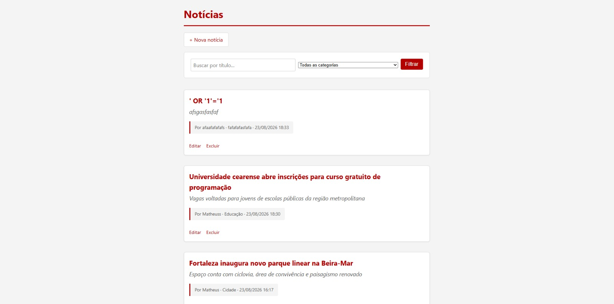
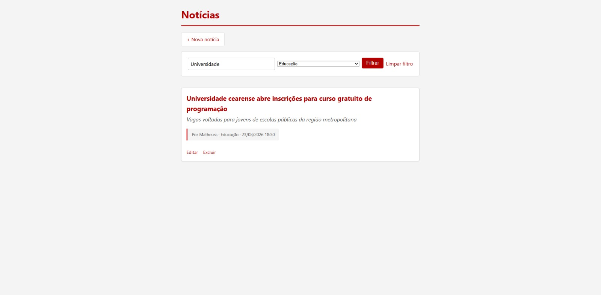
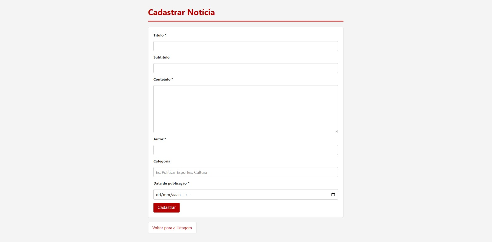
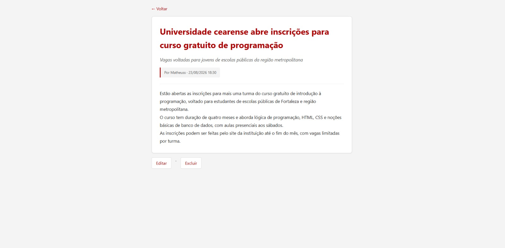
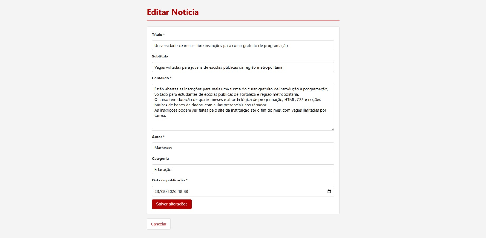

# Sistema de Notícias — CRUD em PHP

Projeto desenvolvido como teste prático para o processo seletivo de **Aprendiz Back-end** do Grupo de Comunicação O POVO. Consiste em um CRUD (Create, Read, Update, Delete) de notícias, construído em PHP puro com MySQL, seguindo boas práticas de organização, segurança e versionamento.

---

## Screenshots

### Listagem de notícias


### Busca e filtro por categoria


### Cadastro de notícia


### Visualização de notícia


### Edição de notícia


---

## Tecnologias utilizadas


---

## Estrutura do projeto

```
opovo-crud-noticias/
├── config/
│   └── database.php       # Conexão com o banco (PDO)
├── public/                 # Arquivos acessíveis pelo navegador
│   ├── index.php           # Listagem e busca de notícias
│   ├── criar.php           # Formulário de cadastro
│   ├── editar.php          # Formulário de edição
│   ├── excluir.php         # Ação de exclusão
│   ├── visualizar.php      # Detalhe de uma notícia
│   ├── css/style.css
│   └── js/script.js
├── src/
│   └── Noticia.php         # Classe de acesso a dados da entidade Notícia
├── tests/
│   └── NoticiaTest.php     # Testes automatizados (PHPUnit)
├── database/
│   └── schema.sql          # Script de criação do banco e da tabela
├── docs/
│   └── screenshots/        # Imagens usadas neste README
├── composer.json
├── phpunit.xml
├── TESTES.md                # Roteiro de testes manuais
└── README.md
```


---

## Como rodar o projeto localmente

### Pré-requisitos

- [XAMPP](https://www.apachefriends.org/) (ou qualquer ambiente com Apache + PHP + MySQL)

### Passo a passo

1. Clone este repositório dentro da pasta `htdocs` do XAMPP:
```bash
   git clone https://github.com/math109/opovo-crud-noticias.git
```
2. Inicie o **Apache** e o **MySQL** pelo painel do XAMPP.
3. Acesse o phpMyAdmin (`http://localhost/phpmyadmin`) e execute o script `database/schema.sql` para criar o banco de dados e a tabela.
4. Acesse o projeto no navegador: http://localhost/opovo-crud-noticias/public/index.php


> Por padrão, a conexão em `config/database.php` usa o usuário `root` sem senha, que é a configuração padrão do XAMPP. Caso seu ambiente use outra configuração, ajuste esse arquivo.

---

## Decisões técnicas

| Decisão | Motivo |
|---|---|
| **PDO em vez de mysqli** | API mais consistente para prepared statements, prevenindo SQL Injection |
| **Separação em camadas** | A classe `Noticia` (em `src/`) concentra o acesso ao banco; os arquivos em `public/` cuidam só da apresentação e do fluxo da requisição — facilita manutenção e testes |
| **Padrão Post/Redirect/Get** | Após criar/editar/excluir, o usuário é redirecionado via `header('Location: ...')`, evitando reenvio duplicado de formulário ao atualizar a página |
| **Validação em duas camadas** | JavaScript valida no navegador para feedback imediato; o PHP revalida no servidor, já que a validação client-side pode ser contornada |
| **`htmlspecialchars()` em todo dado exibido** | Previne ataques de XSS (Cross-Site Scripting) ao renderizar conteúdo digitado por usuários |

---

## Testes

Veja o arquivo [`TESTES.md`](./TESTES.md) com o roteiro de testes manuais realizados, cobrindo os quatro fluxos do CRUD e os principais casos de erro.

---

## Possíveis melhorias futuras

Este projeto foi desenvolvido dentro do escopo do teste prático, mas algumas evoluções poderiam agregar valor em uma versão futura:

- **Autenticação de administrador** — restringir cadastro/edição/exclusão a usuários logados, mantendo a listagem pública
- **API REST** — expor os dados de notícias em formato JSON, permitindo integração com outras aplicações (ex: um app mobile)
- **Upload de imagem de capa** — permitir anexar uma imagem a cada notícia
- **Editor de texto rico (WYSIWYG)** — substituir o `<textarea>` simples por um editor com formatação (negrito, links, etc)
- **Testes automatizados end-to-end** — além dos testes unitários já existentes, adicionar testes que simulam a navegação completa pelo navegador (ex: com Selenium ou Cypress)

## Autor

**Matheus Martins da Costa Lima**
Projeto desenvolvido para o processo seletivo de Aprendiz Back-end — O POVO
